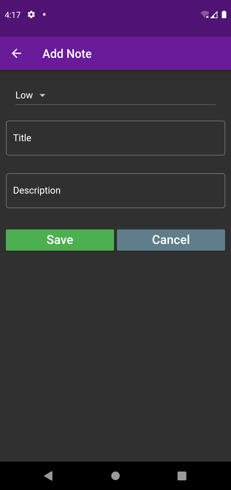

# Notes Keeper App Flutter

<ol>
  <li>Add notes by clicking on the (+) add floating action button.</li>
  <li>Set priority of the note - Low/High.</li>
  <li>The title field must be entered.</li>
  <li>Description is optional.</li>
  <li>Tap on save to save the note</li>
  <li>To edit a note, simply click on the note.</li>
  <li>To delete the note, click on delete button in Edit Note section.</li>
  <li>OR simply click on the trash icon in the list.</li>
<ol>
 
<table>
  <tr>
    <th><h3>Home Screen</h3></th>
    <th><h3>Add Note</h3></th>
    <th><h3>Form Validation</h3></th>
  </tr>
  <tr>
    <td></td>
    <td></td>
    <td></td>
  </tr>
</table>
<table>
  <tr>
    <th><h3>Entering text</h3></th>
    <th><h3>Note Saved</h3></th>
    <th><h3>Edit Note</h3></th>
    <th><h3>Delete Note</h3></th>
  </tr>
  <tr>
    <td></td>
    <td></td>
    <td></td>
    <td></td>
  </tr>
</table>
